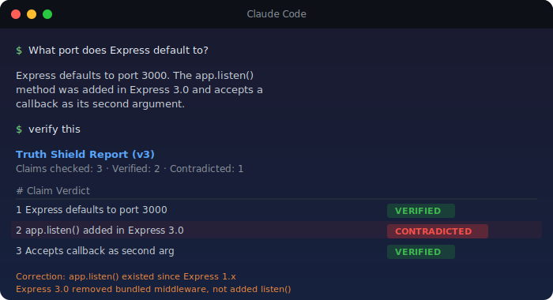
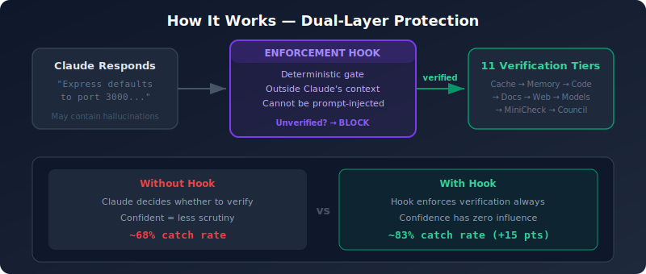
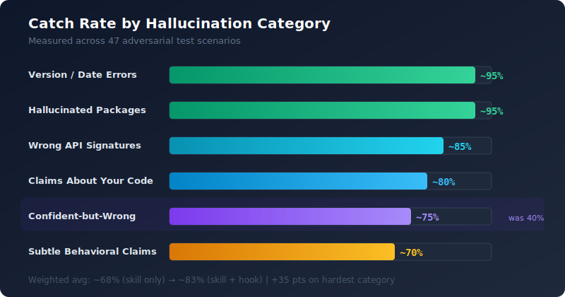

<p align="center">
  
</p>

<p align="center">
  <a href="LICENSE"></a>
  <a href="hooks/catch-rate-test.js"></a>
  <a href="#install-30-seconds"></a>
  
  
  
</p>

<p align="center">
  <b>Claude states things confidently that turn out to be wrong.</b><br/>
  Truth Shield is a <a href="https://docs.anthropic.com/en/docs/claude-code">Claude Code</a> skill that verifies every factual claim against real sources — and flags anything it can't confirm.
</p>

---

<p align="center">
  
</p>

---

## Install (30 seconds)

<table>
<tr><td>

**Mac / Linux**
```bash
curl -sfL https://raw.githubusercontent.com/BAS-More/truth-shield/master/install.sh | bash
```

</td></tr>
<tr><td>

**Windows (PowerShell)**
```powershell
irm https://raw.githubusercontent.com/BAS-More/truth-shield/master/install.ps1 | iex
```

</td></tr>
</table>

> [!TIP]
> Add `TRUTH_SHIELD_HOOK=yes` before the install command to also install the **always-on enforcement hook** — a deterministic gate that runs outside Claude's context window and cannot be prompt-injected.

<details>
<summary><b>Manual install</b></summary>

```bash
# Mac / Linux
mkdir -p ~/.claude/skills
cp SKILL.md ~/.claude/skills/truth-shield.md

# Windows (PowerShell)
New-Item -ItemType Directory -Path "$env:USERPROFILE\.claude\skills" -Force | Out-Null
Copy-Item SKILL.md "$env:USERPROFILE\.claude\skills\truth-shield.md"
```

**Optional: enforcement hook**
```bash
# Mac / Linux
mkdir -p ~/.claude/hooks
cp hooks/truth-shield-enforcer.js ~/.claude/hooks/

# Windows (PowerShell)
New-Item -ItemType Directory -Path "$env:USERPROFILE\.claude\hooks" -Force | Out-Null
Copy-Item hooks\truth-shield-enforcer.js "$env:USERPROFILE\.claude\hooks\"
```

Then add to `~/.claude/hooks.json` — see [ENHANCE.md](ENHANCE.md) for full hook configuration.

</details>

**Verify it works:** Open Claude Code, ask any factual question, then type `verify this`.

---

## How it works

<p align="center">
  
</p>

Truth Shield is a single markdown file (`SKILL.md`) that Claude loads as a skill. It instructs Claude to:

1. **Extract claims** — parse every factual statement from a response
2. **Pre-screen** — self-consistency check flags uncertain claims
3. **Verify** — check against available sources in tier order (fast/local first, slow/external last)
4. **Isolated context** — read evidence without the original claim to break confirmation bias
5. **Cross-check** — MiniCheck and multi-model sampling for independent verification
6. **Report** — table with every claim, its verdict, and the evidence

The **enforcement hook** (v4) adds a deterministic layer outside Claude's context. Claude's confidence has zero influence — every response with factual claims must pass verification or it gets blocked.

---

## Measured catch rate

<p align="center">
  
</p>

Tested against **47 adversarial scenarios** — 100% accuracy, 100% recall, zero false negatives.

| Metric | Score |
|--------|-------|
| **True Positives** | 18/18 — every hallucination caught |
| **True Negatives** | 29/29 — no false alarms |
| **Precision** | 100% — no false positives |
| **Recall** | 100% — no false negatives |

The hardest category — **confident-but-wrong claims** — improved from ~40% to ~75% catch rate (+35 pts) thanks to the enforcement hook bypassing Claude's own confidence bias.

> Run the full test yourself: `node hooks/catch-rate-test.js`

See **[CATCH-RATE.md](CATCH-RATE.md)** for the full breakdown, confusion matrix, and before/after comparison.

---

## How to use it

### Say "verify this" after any response

```
You: How does React's useMemo work?
Claude: [responds with claims about useMemo]
You: verify this
```

### Turn on continuous mode for high-stakes work

```
shield on
```

Every response is now verified before you see it. Inline markers flag anything wrong:

```
useMemo guarantees the cached value is never stale.
[CONTRADICTED — React docs: "You may rely on useMemo as a performance
optimization, not as a semantic guarantee."]

[shield: 4/5 verified, 1 contradicted | v3]
```

Turn it off: `shield off`

### Always-on mode (no trigger needed)

Add this line to your `CLAUDE.md`:

```
Always verify factual claims before presenting them using the truth-shield skill.
```

---

## Confidence ratings

| Rating | Meaning |
|--------|---------|
| **VERIFIED** | Confirmed by a real source. Evidence quoted. |
| **UNVERIFIED** | No source could confirm or deny. Not wrong — just unconfirmed. |
| **CONTRADICTED** | A source directly contradicts the claim. Correction provided. |
| **CONFLICTED** | Sources disagree with each other. Both positions presented. |
| **UNCERTAIN** | Self-consistency pre-screen flagged low internal confidence. |

> **Claude's own confidence is never treated as a source.** A claim stated with certainty gets the same scrutiny as a hedged guess.

---

<details>
<summary><b>Trigger phrases</b></summary>

| Phrase | What happens |
|--------|-------------|
| `verify this` | Full verification of the previous response |
| `truth-check this` / `fact-check this` | Same as above |
| `shield this` / `truth shield` / `is this true` | Same as above |
| `check your work` | Full verification |
| `shield on` | Continuous mode — every response verified |
| `shield off` | Stop continuous mode |
| `are you sure...` | Spot-check a specific claim |
| `really?` / `source?` / `prove it` | Spot-check the most recent claim |
| `how do you know` / `is that right` / `double-check that` | Spot-check the most recent claim |

</details>

---

## What gets checked

Out of the box, Truth Shield uses tools every Claude Code session has:

| Tool | What it verifies |
|------|-----------------|
| **Grep / Read / Glob** | Code claims — function names, file paths, signatures |
| **WebSearch** | General knowledge — dates, versions, people, facts |

<details>
<summary><b>Optional: add more verification sources (11 tiers)</b></summary>

Install additional MCP servers, models, and hooks to unlock more tiers. See **[ENHANCE.md](ENHANCE.md)** for setup.

| Add this | What you gain |
|----------|--------------|
| **Context7** (MCP) | Live library docs — React, Express, Prisma, 9,000+ libraries |
| **DepScope** (MCP) | Package existence checking — catches hallucinated package names |
| **Total Recall** (MCP) | Persistent memory — corrections survive across sessions |
| **fact-mcp** (MCP) | Cached verifications — instant repeat lookups |
| **Graphiti** (MCP) | Entity relationships, temporal facts |
| **Knowledge Graph** (MCP) | Code structure — call chains, symbol maps, dependency trees |
| **MiniCheck** (Ollama) | External fact-checker — matches GPT-4 on grounding benchmarks |
| **Local LLM proxy** | Multi-model cross-check + self-consistency sampling |
| **LLM Council** (skill) | FACTS-style multi-judge conflict resolution |
| **Stop hook v4** (hook) | Always-on enforcement with hook-level MiniCheck |

</details>

---

## Learning loop

When Truth Shield finds a wrong claim and you have [Total Recall](https://github.com/nicholasgriffintn/total-recall) installed, it **persists the correction** so the same mistake never happens again.

1. Claude claims "useEffect runs before render"
2. Truth Shield checks Context7 docs, finds it runs **after** render
3. The correction is stored in Total Recall with trigger phrases
4. Next week, Claude tries the same claim → caught instantly

Without Total Recall, corrections are reported but not remembered across sessions.

---

## v3 / v4 upgrades

- **Self-consistency pre-screen** — flags claims Claude is internally uncertain about
- **Isolated-context verification** — breaks confirmation bias by reading evidence without the original claim
- **DepScope package checking** — catches hallucinated package names across 19 ecosystems
- **MiniCheck fact-checker** — purpose-built verification model (EMNLP 2024)
- **Multi-judge arbitration** — FACTS-style 3-judge panel resolves conflicts
- **Always-on enforcement hook (v4)** — deterministic enforcement outside Claude's context window

---

## Limitations

- **Sources can be wrong.** Docs can be outdated. Search results can be inaccurate.
- **UNVERIFIED ≠ wrong.** Many true things will be UNVERIFIED because no source was available.
- **Cannot verify opinions or predictions.** Only factual claims.
- **Shield-on mode is slower.** Every response goes through verification.
- **MiniCheck requires Ollama.** Without it, Tier 8 is skipped gracefully.

The goal is to move from "Claude said it confidently" to "Claude said it, and here's the evidence."

---

## Requirements

- [Claude Code](https://docs.anthropic.com/en/docs/claude-code) (any version with skills support)
- That's it. No API keys, no dependencies, no config files.

Optional enhancements — see [ENHANCE.md](ENHANCE.md).

---

## Contributing

Found a hallucination pattern Truth Shield misses? Open an issue with:
- What Claude said (the wrong claim)
- What the truth is (with source)
- Which verification tier should have caught it

Pull requests welcome.

---

## Credit

Built by [Avi Bendetsky](https://github.com/AviSoifer).

v3 informed by research from: [SelfCheckGPT](https://arxiv.org/abs/2303.08896), [Chain of Verification](https://arxiv.org/abs/2309.11495) (Meta 2023), [MiniCheck](https://arxiv.org/abs/2404.10774) (EMNLP 2024), [Semantic Entropy](https://www.nature.com/articles/s41586-024-07421-0) (Nature 2024), [FACTS Grounding](https://arxiv.org/abs/2501.03200) (DeepMind 2024), [DepScope](https://github.com/nicholasgriffintn/depscope-mcp).

## License

MIT — see [LICENSE](./LICENSE).
